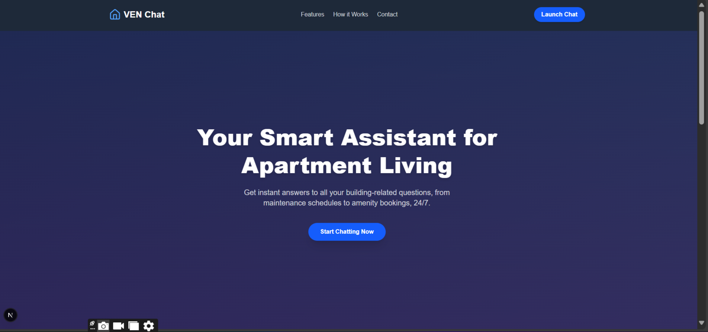
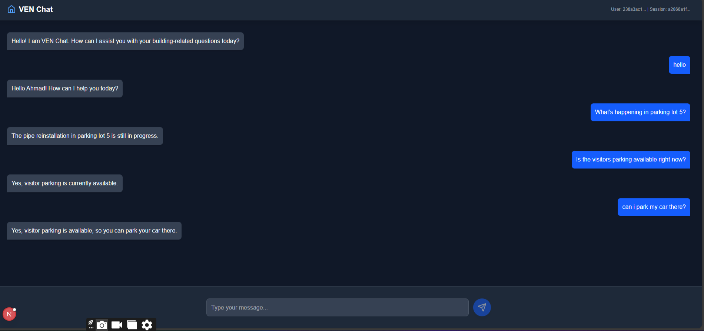
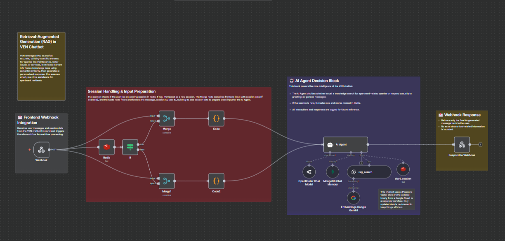

# VEN Chat 🏠

An **AI-powered apartment assistant** built for residential buildings — answers tenant questions about maintenance, parking, amenities, and building services instantly, 24/7.

Built with n8n, RAG (Pinecone), Redis session memory, and a custom Next.js frontend. Deployed as a full-stack product, not a demo.

---

## Product

### Landing Page


### Chat Interface


Tenants ask questions in natural language. VEN retrieves accurate, building-specific answers from a live knowledge base — not hallucinated responses.

---

## Workflow

### n8n Pipeline


---

## How It Works

```
Tenant sends message (Frontend → Webhook)
            ↓
  Check Redis for existing session
      ↓               ↓
  New session     Existing session
            ↓
    Merge input + session context
            ↓
    AI Agent Decision Block
      ↓               ↓
 Building query   General message
      ↓
 RAG Search (Pinecone)
 — semantic similarity on building KB —
      ↓
 Gemini generates grounded answer
      ↓
 Webhook → Frontend response
```

---

## Key Design Decisions

**Why RAG over fine-tuning?**
Building data changes constantly — maintenance schedules, parking status, amenity availability. RAG lets the knowledge base update without retraining anything. Fine-tuning would be stale within days.

**Why Redis for session memory?**
Each tenant conversation needs context across messages without storing full chat history in the vector store. Redis handles short-term session state cleanly and fast.

**Why an AI Agent decision block?**
Not every message needs a knowledge base lookup. Greetings and general questions can be handled directly. The agent decides whether to call RAG or respond immediately — cutting unnecessary Pinecone queries and keeping latency low.

---

## Tech Stack

| Layer | Technology |
|---|---|
| Workflow Engine | n8n (self-hosted) |
| LLM | Google Gemini (via OpenRouter) |
| Vector Store | Pinecone |
| Session Memory | Redis |
| Chat History | MongoDB |
| Frontend | Next.js |
| Trigger | Webhook |

---

## Repo Structure

```
VEN-chatbot/
├── README.md
├── workflows/
│   └── VEN_Chatbot.json
├── frontend/
│   ├── src/
│   ├── public/
│   ├── package.json
│   ├── next.config.mjs
│   ├── jsconfig.json
│   ├── .gitignore
│   ├── eslint.config.mjs
│   └── postcss.config.mjs
└── screenshots/
    ├── ven_landing_page.png
    ├── chat_page.png
    └── VEN_chatbot.png
```

---

## How to Run

**Backend (n8n workflow):**
1. Import `workflows/VEN_Chatbot.json` into n8n
2. Add credentials: Gemini API, Pinecone, Redis, MongoDB
3. Activate the workflow — note the webhook URL

**Frontend (Next.js):**
1. `cd frontend`
2. `npm install`
3. Add your n8n webhook URL to the environment config
4. `npm run dev` for local, `npm run build` for production

---

## Author

**Ahmad Hassan** — AI & Data Engineer
[LinkedIn](https://www.linkedin.com/in/ahmadhassan08/) · [Email](mailto:contactahmad.ds@gmail.com)
